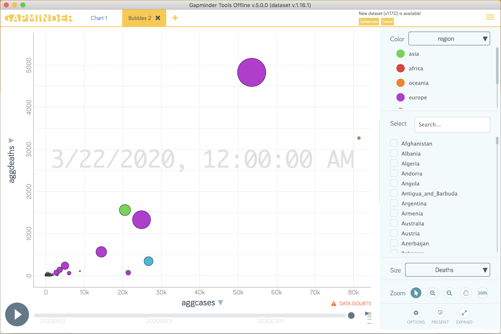
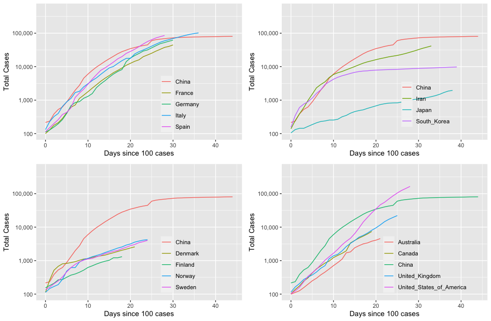

# covid2019

covid19.R is the R script which I use in RStudio

The file *COVID-19-geographic-disbtribution-worldwide-2020-03-22.xlsx* contains
the data provided by ECDC, and can be read by the function **getexcelfromfile()**.
The script also supports (default) getting the file directly from the ECDC
website using the method **getexcelfromurl()**.

*region_names.xlsx* is a list of country name to region mappings. It is read
bu the R script. If a country is missing the region will be set to 'na'.

*gapminder.xlsx* is a Gapminder compatible excel file generated by the R script.

Importing the excel file into the Gapminder offline tools will create plots
like the one shown below.

The script uses the **ggplot2** package to produce comparison plots for
selected countries.

